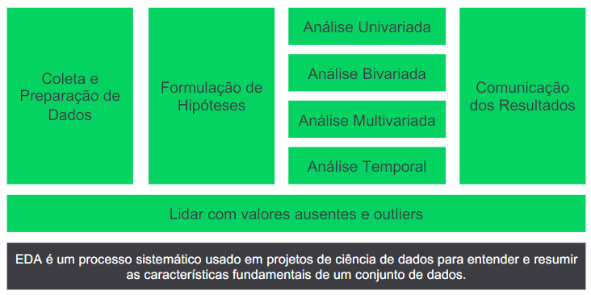

# EXPLORATORY DATA ANALYSIS

O objetivo da **Análise Exploratória de Dados (EDA – Exploratory
Data Analysis)** é dar uma boa espiada nos dados antes de
começar a fazer coisas mais complicadas. É como o investigador
curioso que olha primeiro para entender do que se trata. A análise
ajuda a descobrir **segredos escondidos** nos números, **padrões
estranhos** e até **erros**, para que possamos tomar decisões mais
inteligentes e contar histórias mais interessantes com nossos
dados. É como a primeira pista em um quebra-cabeça gigante de
informações.

## 1. O QUE É EDA?

## 2. O QUE É A BIBLIOTECA PANDAS?

O **Pandas** é uma biblioteca de **Python** amplamente usada
para análise de dados. Sua principal vantagem é sua
capacidade de **manipular**, **limpar** e **analisar** dados de forma
eficiente. Ele fornece estruturas de dados flexíveis, como
**Series** e **DataFrames**, que permitem organizar dados em
tabelas, realizar operações complexas, como **filtros** e
**agregações**, e facilitar a **visualização** dos resultados. O
Pandas também é compatível com **várias fontes de dados**,
como arquivos **CSV**, **Exce**l e **bancos de dados**, tornando-o
essencial para cientistas de dados e analistas que desejam
explorar e extrair insights de dados de maneira eficaz e
intuitiva.

## 3. O CONTEXTO DO NOSSO PROBLEMA

O contexto que iremos analisar neste módulo de Análise
Exploratória é do **segmento de telecom**. A empresa possui três
conjuntos de dados de clientes e serviços, com uma variável que
determina se o cliente **abandonou (churn)** ou não a empresa de
telecom.

O intuito é que com estes conjuntos de dados e com base em
algumas hipóteses que iremos formular e que serão respondidas
pelo EDA, possa obter alguns **insights iniciais** para a construção
de inteligência artificial que possa **“prever” o abandono de clientes
ainda ativos.**
